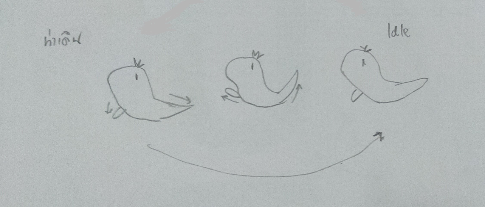
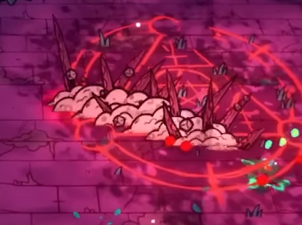
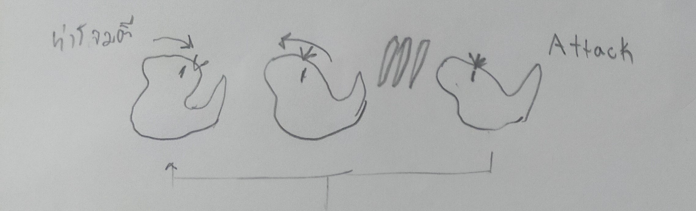
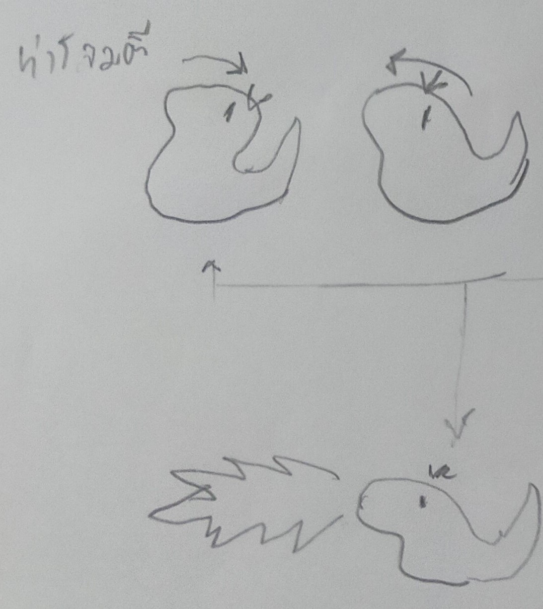
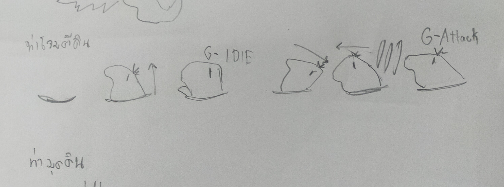
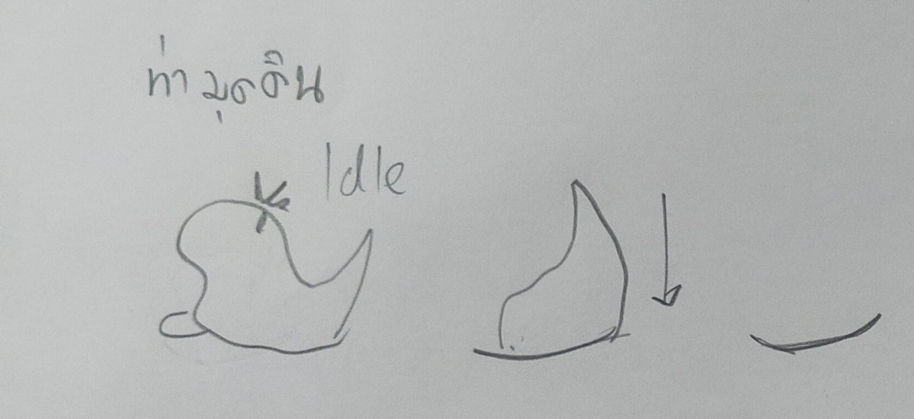
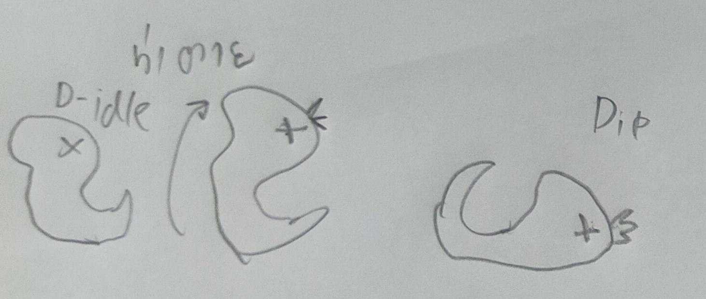

# มอนพริก
ม่อนพริกจะเดินอยู่ตาม Filed ภูเขา เมื่อผู้เล่นเจ้าใกล้ม่อนพริกจะมุดดินหนี และเมื่อเวลาผ่านไป 2 วินาที มอนพริกจะขุดดินขึ้นมาตั้งท่า idle และโจมตีผู้เล่นด้วยท่ากัดธรรมดาทันทีหากเดินหนีมันก็จะวิ่งตามไปกัด
เมื่อมอนพริกเลือดเหลือครึ่ง มอนพริกจะทำการพ่นไฟใส่ผู้เล่นเป็นเวลา 4 วินาที หากผู้เล่นไม่ออกมาจากรัศมีของไฟก็จะถูกเผาและลดพลังชีวิตไปเรื่อย และเมื่อพลังชีวิตของมอนพริกเลือดต่ำกว่าครึ่ง ม่อนพริกจะมุดดินลงไปและโจมตีผู้เล่นด้วยท่ากัดจากดินแทน
## ท่าทางของมอนพริก
- Idle
  > มอนพริกยืนอยู่กับที่พร้อมกับขยับหัวและหางเล็กน้อย
  >
  > 
- เดิน
  > มอนพริกจะคลานไปข้างหน้าพร้อมกับยกขาและหางขึ้น
  >
  > 
- ท่าเดินใต้ดินของมอนพริก
  > เมื่อมอนพริกใช้ท่ามุดดินหนีมอนพริกจะคลื่นที่โดยการพรวนดินเพื่อเคลื่อที่และจะไม่สามารถโจมตีได้
  >
  > 
## รูปแบบโจมตี
- กัดธรรมดา
  > มอนพริกจะทำการโยกตัวไปข้างหลังเพื่อที่จะเตรียมโจมตีและโนมตัวมาข้างหน้าเพื่อโจมตี มอนพริกจะทำการโจมตี 3 ครั้ง หลังจากโจมตีเส็จมอนจะยืนนิ่งๆเป็นเวลา 2 วินาทีและโจมตีต่อ
  >
  > 
- พ่นไฟ
  > เมื่อมอนพริกเลือดเหลือครึ่งหนึ่ง ม่อนพริกจะเอนตัวไปข้างหลังเพื่อเตรียมพ่นไฟและโน้วตัวไปด้านหน้าเพื่อพ่นไฟออกมา หากผู้เล่นไม่ออกมาจากรัศมีของไฟก็จะถูกเผาและลดพลังชีวิตไปเรื่อยๆ มอนพริกจะใช้เวลาพ่นไฟเป็นเวลา 2-3 วินาที
  > 
- โผล่มากัดผู้เล่นจากดิน
  > เมื่อมอนพริกพลังชีวิตต่ำกว่าครึ่งมอนพริกจะอยู่แต่ในดินและโผล่ตัวมาโจมตีด้วยท่ากัดจากดินเท่านั้น
  >
  > ก่อนโจมตีมอนพริกจะทำการโยกตัวไปข้างหลังเพื่อที่จะเตรียมโจมตีและโน้มตัวมาข้างหน้าเพื่อโจมตีในท่ากัดจากดิน มอนพริกจะโจมตีเป็นจำนวน 3 ครั้ง และโจมตีแรงกว่าตอนอยู่บนดิน
  >
  > 
- มุดดินหนี
  > มอนพริกจะมุดลงไปในดินในตอนที่เจอกับผู้เล่นครั้งแรกและจะโผล่ขึ้นมาภายในไม่กี่วินาที แต่เมื่อพลังโจมตีของม่อนพริกเหลือต่ำกว่าครึ่ง ตัวมอนก็จะอยู่ใต้ดินเท่านั้น และโจมตีแรงขึ้น
  >
  > 
## รูปแบบเมื่อโดนโจมตี
- หากมอนพริกโดนผู้เล่นโจมตีในขณะที่อยู่บนดิน จะเกิดการ knockback ตัวกระพริบ และเสียเลือด 
- หากถูกโจมตีในขณะที่อยู่ในท่ากัดจากดิน จะไม่เกิด knockback แต่ตัวจะกระพริบและเสียเลือด
- เมื่อมอนพริกตาย มอนพริกจะหงายหลังลงไปนอนและร่างจะหายไป พร้อมกับดรอปของให้ผู้เล่น
